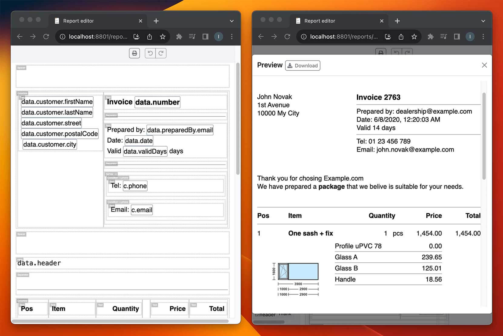

<div align="center">
  <a href="https://github.com/othneildrew/Best-README-Template">
    
  </a>

  <h1 align="center">PantherPDF</h1>

  <p align="center">
    WYSIWYG report editor + managed service for <strong>editing reports</strong> and <strong>generating PDFs</strong>.
    <br />
    <a href="https://www.pantherpdf.com/docs/"><strong>Explore the docs »</strong></a>
    <br />
    <br />
    <a href="https://www.pantherpdf.com/login/">Try editor</a>
  </p>
</div>

Powerful TypeScript library designed for creating elegant and customized reports that can be seamlessly converted into PDF documents. This versatile library offers a plethora of features and capabilities, making it an essential tool for any application seeking a robust solution for generating high-quality PDF reports.

## 📸 Screenshot

*Invoice template and final result*

## 💪 Features
1. **Empower** business users to design documents
2. Intuitive **drag-and-drop** WYSISYG editor
3. Powerful data bindings and rich built in widgets
4. Extend with **custom widgets**, specific for your business domain
5. Use **JavaScript code** to generate complex widgets, fetch data from database etc

## 💼 Managed service
We offer managed editor hosting and PDF generation service.
While free editor is limited to React framework only, managed editor is embedded
using `<iframe>` into any framework. Service includes
additional email and phone support. Check it out!

## 👩🏻‍💻 Usage
Install peer dependencies
```sh
npm install --save bootstrap react react-dom
```

```tsx
import React, { useState } from 'react';
import { Report, Editor, ApiEndpoints, emptyReport } from 'pantherpdf';

const editorApi: ApiEndpoints = {};

function App() {
  const [report, setReport] = useState<Report>(emptyReport);
  return (
    <Editor
      report={report}
      setReport={setReport}
      api={editorApi}
    />
  );
}
```

`Editor` is a controlled component. Data is supplied/updated using props
`report` and `setReport`. It can be used to load and save data to/from database.
See [demo/Container.tsx](demo/Container.tsx) for detailed example.

## 👷🏻‍♂️ Development
Use [demo project](demo/Container.tsx) for development.
```sh
npm run start
```

Running tests:
```sh
npm run test
```

## 🔥 Extending with custom widgets
Editor can be extended with custom `Widget`s and `Transform`s. Widgets are
visual building blocks for reports. Transforms are used for transforming
source data before it is consumed by widgets. See property descriptions for
each type for detailed explanation.

Custom widgets have to be specified in `EditorProps` and `GenerateTargetArgs`.

```tsx
import {
  Editor,
  EditorProps,
  Widget,
  Transform,
  defaultTransforms,
  defaultWidgets,
} from 'pantherpdf';

const myCustomWidget: Widget = { /* ... */ };
const myCustomTransform: Transform = { /* ... */ };

const editorProps: EditorProps = {
  /* ... */
  widgets: [...defaultWidgets, myCustomWidget],
  transforms: [...defaultTransforms, myCustomTransform],
};
const generateArgs: GenerateTargetArgs = {
  /* ... */
  widgets: [...defaultWidgets, myCustomWidget],
  transforms: [...defaultTransforms, myCustomTransform],
};

function App() {
  return <Editor {...editorProps} />;
}
```

## ☎️ Feedback and feature requests
Open an issue!<br/>
For our customers we offer email and phone support.

## 🤝 Contributing
Contributions are welcome!

## ⚖️ License
MIT<br/>
Copyright © Ignac Banic, 2021-present
